<div align="center">



<br />

<sub>SOFTWARE ENGINEER&nbsp;&nbsp;/&nbsp;&nbsp;MACHINE LEARNING&nbsp;&nbsp;/&nbsp;&nbsp;COMPUTER VISION</sub>

</div>

<br />

<table width="100%">
<tr>
<td colspan="3">


</td>
</tr>
<tr>
<td width="23%" valign="middle">

### 01 / SYSTEM

**FOCUS**  
ideas

**EXPOSE**  
experiments

**DEPTH**  
systems

**FRAME**  
ongoing

</td>
<td width="54%" valign="top">

I build software around **machine learning, computer vision, language, and intelligent systems.**

My preference is to understand the machinery underneath the interface — models, representations, algorithms, data, constraints, and the occasional failure that teaches more than the successful run.

</td>
<td width="23%" valign="middle">

```
CURRENT
AI · ML
COMPUTER VISION
LLMs · SYSTEMS

MODE
experimental

STATE
building
```

</td>
</tr>
</table>

<br />

<table width="100%">
<tr>
<td colspan="4">


</td>
</tr>
<tr>
<td width="25%" valign="top">

**01 / ASTERIA**

[ASTERIA](https://github.com/Yashvir-13/Asteria)

<sub>AI · INFORMATION RETRIEVAL</sub>

A software system exploring how information can be retrieved, connected, and made useful through an AI-driven interface.

`PYTHON` · `LLM` · `RETRIEVAL`

</td>
<td width="25%" valign="top">

**02 / FATHOM**

[FATHOM](https://github.com/Yashvir-13/An-Epistemically-Constrained-Philosophical-Conversational-Agent)

<sub>LLM · REASONING · EPISTEMICS</sub>

An experiment in constrained conversational reasoning — what changes when a system is deliberately given boundaries on what it can claim to know.

`PYTHON` · `LLM` · `REASONING`

</td>
<td width="25%" valign="top">

**03 / SAMVEDNA**

[SAMVEDNA](https://github.com/Yashvir-13/ISL)

<sub>COMPUTER VISION · LANGUAGE</sub>

A pipeline from visual gesture to machine-readable language, using Indian Sign Language as the problem domain.

`VISION` · `LANGUAGE` · `PYTHON`

</td>
<td width="25%" valign="top">

**04 / FRAME INTERPOLATION**

[FRAME INTERPOLATION](https://github.com/Yashvir-13/Cinematic-Frame-Interpolation-Using-Classical-Techniques)

<sub>COMPUTER VISION · MOTION</sub>

Generating intermediate video frames with classical optical-flow techniques — treating motion estimation as the core problem rather than hiding it behind an end-to-end model.

`OPENCV` · `OPTICAL FLOW` · `VIDEO`

</td>
</tr>
</table>

<br />

<table width="100%">
<tr>
<td colspan="2">


</td>
</tr>
<tr>
<td width="62%" valign="middle">

```
IDEA ─────► REPRESENT ─────► COMPUTE ─────► VISUALISE ─────► QUESTION
  ▲                                                               │
  └──────────────────────── ITERATE ◄─────────────────────────────┘
```

</td>
<td width="38%" valign="top">

**LANGUAGES** &nbsp;&nbsp; Python, C/C++  
**AI / ML** &nbsp;&nbsp; PyTorch, Transformers, LangChain  
**COMPUTER VISION** &nbsp;&nbsp; OpenCV, NumPy, scikit-image  
**DATA / MLOPS** &nbsp;&nbsp; PostgreSQL, Docker, Git, Linux

</td>
</tr>
</table>

<br />

<table width="100%">
<tr>
<td colspan="2">


</td>
</tr>
<tr>
<td width="60%" valign="middle">

**CONTRIBUTIONS / ACTIVITY / CONSISTENCY**

<br />

<!-- Replace these with your preferred GitHub statistics service if desired. -->

```
JAN   FEB   MAR   APR   MAY   JUN   JUL   AUG   SEP   OCT   NOV   DEC
░░░   ░▓░   ░░░   ▓██   ░░▓   ▒██   ░▓░   ▓▓░   ▒▓▓   ░░░   ░░░   ░░░
```

</td>
<td width="40%" valign="middle" align="center">

**150**  
<sub>TOTAL CONTRIBUTIONS</sub>

&nbsp;&nbsp;&nbsp;&nbsp;

**3**  
<sub>REPOSITORIES</sub>

&nbsp;&nbsp;&nbsp;&nbsp;

**3**  
<sub>CURRENT STREAK</sub>

<br /><br />

<sub>“A RECORD OF CONSISTENCY, NOT ACCOMPLISHMENT.”</sub>

</td>
</tr>
</table>

<br />

<table width="100%">
<tr>
<td colspan="2">


</td>
</tr>
<tr>
<td width="56%" valign="top">

I like systems that expose their mechanics.

I tend to move toward problems involving **perception, representation, temporal information, and the boundary between human and machine interpretation.**

Not everything here is finished. Some repositories are experiments; some are attempts to answer a question; some are simply useful evidence that I tried.

</td>
<td width="44%" valign="top">

```
CAMERA                         BUILD
─────────────────────          ─────────────────
FPS        24                  STATUS     ● ACTIVE
SHUTTER    1/48                FOCUS      systems
FRAME      001                 ZOOM       variable
FORMAT     RAW                 EXPOSURE   ongoing
```

</td>
</tr>
</table>

<br />

<table width="100%">
<tr>
<td width="52%" valign="top">

### 06 / WHEN I'M NOT CODING

Film · photography · writing · music

[Medium](https://medium.com/@yashvir.126) · [YouTube](https://www.youtube.com/watch?v=5Uh2H4MIgHY&t=9s)

</td>
<td width="48%" valign="top">

### / CONNECT

[GitHub](https://github.com/Yashvir-13) · [LinkedIn](https://www.linkedin.com/in/yashvir-singh-71281228) · [Portfolio](https://portfolio-five-lake-20.vercel.app/)

</td>
</tr>
</table>

<br />

<div align="center">

<sub>YASHVIR-13 / BUILD 2026.09 / STATUS: ACTIVE</sub>

</div>
